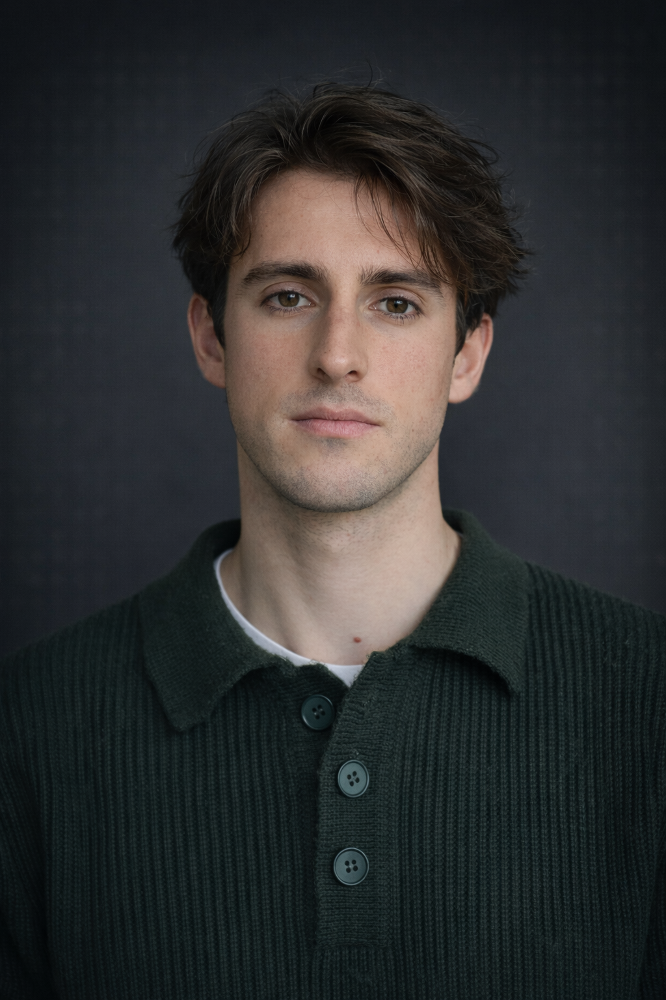

## Emanuele Rimoldi

Hello! I’m Emanuele 👋 — currently a Visiting Researcher at MIT, fortunately advised by [Pierfrancesco Beneventano](https://scholar.google.com/citations?user=spL439oAAAAJ) and [Tomaso Poggio](https://scholar.google.com/citations?user=WgAGy7wAAAAJ). I work on the mathematical foundations of agentic AI systems: how learning, generalization, and reasoning emerge when agents interact with the world 🧠📐

Previously, I was a Research Intern in the Logitech Switzerland CTO Research Office, where I worked on pretraining and post-training foundation models (advised by [Jonathan Dan](https://scholar.google.com/citations?user=0uHd7XIAAAAJ)). I also interned at the Idiap Research Institute (advised by [Phil Garner](https://scholar.google.com/citations?user=c9nAX2AAAAAJ)), focusing on bio-inspired TTS systems and spiking neural networks.

Outside the lab, I’m not just a nerd: you’ll find me doing sports (preferably outdoors), taking photos, and generally being curious about pretty much everything 🚴‍♂️🏔️📷

If you’re interested in collaborating — or just having a quick chat — feel free to reach out. I genuinely believe everyone has something to teach; it mostly depends on how willing we are to listen 🤝

  
  &nbsp;
  
  &nbsp;
  
  &nbsp;
  

---

### Research & Experience

- **Visiting Researcher:** MIT (Cambridge, MA)
- **AI Research Intern:** Idiap Research Institute (Martigny, Switzerland)
- **AI Research Intern:** Logitech Switzerland, CTO Research Office
- **Research Intern:** Campus Biotech (Geneva, Switzerland)

---

### Education

- **MSc Neuro-X (Data Science & Computational Neuroscience):** EPFL
- **MSc Nuclear Engineering:** ETH Zürich / EPFL / PSI (transferred)
- **BSc Engineering Physics:** Politecnico di Milano
